```python
import matplotlib.pyplot as plt
import pandas as pd
import matplotlib.ticker as ticker

# 1. Prepare the Data
data = {
    "年份": ["2013年", "2014年", "2015年", "2016年", "2017年", "2018年", "2019年", "2020年", "2021年", "2022年"],
    "货币资金等": [6.28, 5.99, 3.01, 3.33, 4.17, 3.74, 6.64, 11.07, 12.96, 12.91],
    "应收账款等": [4.44, 3.98, 5.78, 5.23, 6.87, 8.73, 9.39, 9.80, 13.77, 17.65],
    "预付账款": [1.43, 1.09, 1.29, 1.39, 1.08, 1.45, 1.27, 1.79, 2.79, 2.33],
    "存货": [9.23, 9.32, 9.85, 12.14, 15.37, 18.70, 19.92, 19.93, 22.51, 30.07],
    "其他流动资产": [0.00, 1.21, 0.71, 0.82, 1.19, 1.09, 1.12, 1.54, 2.32, 3.46],
    "长期股权投资": [0.38, 0.23, 0.23, 0.26, 0.31, 0.30, 0.24, 0.20, 0.00, 0.25],
    "商誉": [0.36, 0.36, 0.36, 0.36, 0.36, 0.36, 0.36, 0.36, 0.36, 0.36],
    "固定资产": [37.04, 36.58, 36.09, 34.06, 44.75, 48.07, 51.95, 52.04, 56.59, 70.66],
    "在建工程": [0.79, 0.68, 0.80, 4.57, 1.93, 2.79, 3.43, 3.33, 9.24, 14.04],
    "使用权资产": [0.00, 0.00, 0.00, 0.00, 0.00, 0.00, 0.00, 0.00, 0.21, 0.25],
    "无形资产": [2.71, 2.75, 2.80, 3.03, 2.95, 2.84, 2.92, 3.68, 5.32, 6.10],
    "其他资产": [0.73, 0.63, 1.05, 2.57, 1.30, 1.73, 1.83, 4.33, 8.38, 11.22]
}

df = pd.DataFrame(data)
df.set_index("年份", inplace=True)

# --- 2. EDIT COLORS HERE ---
# Dictionary mapping: Category Name -> Color Code
# You can use Hex codes (e.g. "#FF0000") or standard names (e.g. "red", "blue")
color_map = {
    "货币资金等": "#C00000",   # Deep Red
    "应收账款等": "#ED7D31",   # Orange
    "预付账款": "#A5A5A5",     # Grey
    "存货": "#FFC000",         # Yellow
    "其他流动资产": "#4472C4", # Blue
    "长期股权投资": "#70AD47", # Green
    "商誉": "#255E91",         # Dark Blue
    "固定资产": "#AFABAB",     # Medium Grey
    "在建工程": "#D9D9D9",     # Light Grey
    "使用权资产": "#997300",   # Brown/Gold
    "无形资产": "#E7E6E6",     # Pale Grey
    "其他资产": "#404040"      # Dark Grey/Black
}

# Automatically extract the list of colors in the correct order based on the DataFrame columns
plot_colors = [color_map.get(col, "#333333") for col in df.columns]

# --- 3. Plotting ---
plt.rcParams['font.sans-serif'] = ['SimHei'] 
plt.rcParams['axes.unicode_minus'] = False 

fig, ax = plt.subplots(figsize=(12, 6))

# Use the generated plot_colors list
ax.stackplot(df.index, df.T, labels=df.columns, colors=plot_colors)

# Styling
ax.set_title("资产明细堆积图（单位：亿元）", fontsize=16, pad=20, color='#595959')
ax.set_ylim(0, 180)
ax.yaxis.set_major_formatter(ticker.FormatStrFormatter('%.2f'))
ax.tick_params(axis='both', colors='#595959', labelsize=10)
ax.grid(axis='y', linestyle='--', alpha=0.3, color='gray')
ax.grid(axis='x', linestyle='--', alpha=0.1, color='gray')

# Legend
plt.legend(loc='upper center', bbox_to_anchor=(0.5, -0.08),
          fancybox=False, shadow=False, ncol=6, frameon=False, fontsize=9)

plt.tight_layout()
plt.show()


#注意：货币资金等包括了货币资金、拆出资金和交易性金融资产			
#应收账款等包括了应收票据、应收账款、应收账款融资和合同资产			
```


    
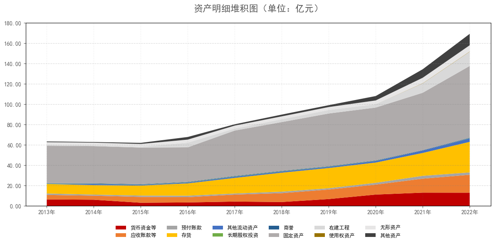
    


```python
import matplotlib.pyplot as plt
import pandas as pd
import matplotlib.ticker as ticker

# 1. Prepare the Data
# Transcribed from the provided source image (image_9ad046.png)
# Note: "-" entries are treated as 0.00
data = {
    "年份": ["2013年", "2014年", "2015年", "2016年", "2017年", "2018年", "2019年", "2020年", "2021年", "2022年"],
    "有息负债": [25.77, 24.56, 20.03, 16.39, 24.90, 27.67, 22.82, 25.29, 36.61, 42.76],
    "应付账款等": [7.07, 5.03, 5.96, 5.80, 9.84, 11.26, 12.05, 11.82, 14.78, 19.23],
    "预收款项等": [0.48, 0.63, 0.66, 1.05, 0.90, 1.40, 1.21, 2.03, 1.69, 1.34],
    "应付职工薪酬等": [0.55, 0.73, 1.04, 1.40, 1.43, 1.42, 1.77, 2.24, 2.28, 2.48],
    "应交税费": [0.00, 0.34, 0.28, 0.46, 0.42, 0.39, 0.77, 1.54, 1.01, 1.40], # Note: 2013 value (-0.92) clamped to 0 for chart stability
    "其他应付款": [0.54, 0.55, 0.43, 0.26, 0.36, 0.47, 0.43, 0.56, 2.82, 2.81],
    "租赁负债": [0.00, 0.00, 0.00, 0.00, 0.00, 0.00, 0.00, 0.00, 0.08, 0.11],
    "长期应付款": [0.02, 0.01, 0.01, 0.52, 0.54, 0.52, 0.39, 0.39, 0.26, 0.26],
    "其他负债": [0.57, 0.65, 0.88, 6.92, 0.95, 1.14, 6.64, 2.32, 2.91, 2.81]
}

df = pd.DataFrame(data)
df.set_index("年份", inplace=True)

# --- 2. EDIT COLORS HERE ---
# Dictionary mapping: Category Name -> Color Code
# Colors picked to match 'image_9ad01e.png'
color_map = {
    "有息负债": "#5B9BD5",       # Light Blue
    "应付账款等": "#ED7D31",     # Orange
    "预收款项等": "#A5A5A5",     # Grey
    "应付职工薪酬等": "#FFC000", # Yellow
    "应交税费": "#4472C4",       # Dark Blue/Purple
    "其他应付款": "#70AD47",     # Green
    "租赁负债": "#255E91",       # Dark Blue
    "长期应付款": "#9E480E",     # Dark Brown/Red
    "其他负债": "#636363"        # Dark Grey
}

# Automatically extract the list of colors in the correct order
plot_colors = [color_map.get(col, "#333333") for col in df.columns]

# --- 3. Plotting ---
plt.rcParams['font.sans-serif'] = ['SimHei'] 
plt.rcParams['axes.unicode_minus'] = False 

fig, ax = plt.subplots(figsize=(12, 6))

# Create the Stackplot
ax.stackplot(df.index, df.T, labels=df.columns, colors=plot_colors)

# Styling
ax.set_title("负债明细堆积图（单位：亿元）", fontsize=16, pad=20, color='#595959')

# Y-axis formatting
ax.set_ylim(0, 80) # Set to 80 to match the target image scale
ax.yaxis.set_major_formatter(ticker.FormatStrFormatter('%.2f'))
ax.tick_params(axis='both', colors='#595959', labelsize=10)

# Add grid lines
ax.grid(axis='y', linestyle='--', alpha=0.3, color='gray')
ax.grid(axis='x', linestyle='--', alpha=0.1, color='gray')

# Legend configuration
# 2 Rows (ncol=5 covers the 9 items neatly in 2 rows)
plt.legend(loc='upper center', bbox_to_anchor=(0.5, -0.08),
          fancybox=False, shadow=False, ncol=5, frameon=False, fontsize=9)

plt.tight_layout()
plt.show()

#注：应付账款等包括了应付票据和应付账款		
#预收款项等包括了预收款项和合同负债		
#应付职工薪酬等包括了应付职工薪酬和长期应付职工薪酬		

```


    
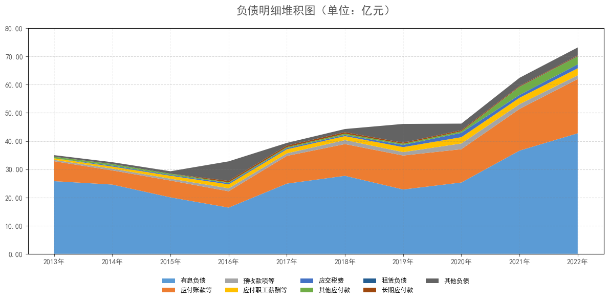
    


```python
import matplotlib.pyplot as plt
import pandas as pd
import matplotlib.ticker as ticker

# 1. Prepare the Data
# Transcribed from the provided source image (image_9b29a1.png)
# Note: "-" entries are treated as 0.00
data = {
    "年份": ["2013年", "2014年", "2015年", "2016年", "2017年", "2018年", "2019年", "2020年", "2021年", "2022年"],
    "实收资本": [3.30, 3.30, 3.30, 8.24, 8.24, 8.24, 8.24, 8.24, 8.33, 8.69],
    "其他权益工具": [0.00, 0.00, 0.00, 0.00, 0.00, 0.00, 0.00, 0.00, 0.00, 0.00],
    "资本公积金": [11.45, 11.45, 11.45, 6.52, 6.52, 6.52, 6.52, 6.53, 9.29, 23.73],
    "其他综合收益": [0.00, -0.59, -0.73, -2.96, -3.06, -4.24, -2.87, -4.64, -4.64, -4.64],
    "库存股": [0.00, 0.00, 0.00, 0.00, 0.00, 0.00, 0.00, 0.00, 2.09, 1.92],
    "专项储备": [0.00, 0.00, 0.00, 0.00, 0.00, 0.00, 0.00, 0.00, 0.00, 0.00],
    "盈余公积": [1.15, 1.23, 1.63, 2.17, 2.89, 3.45, 4.07, 4.96, 4.96, 4.96],
    "未分配利润": [11.93, 12.83, 14.73, 18.56, 23.83, 28.96, 34.33, 43.80, 52.70, 61.75],
    "其他项": [1.48, 2.09, 2.28, 2.44, 2.51, 2.60, 2.68, 2.98, -0.71, -0.32]
}

df = pd.DataFrame(data)
df.set_index("年份", inplace=True)

# --- 2. EDIT COLORS HERE ---
# Dictionary mapping: Category Name -> Color Code
# Colors picked to match 'image_9b2983.png'
color_map = {
    "实收资本": "#4472C4",       # Medium Blue
    "其他权益工具": "#9DC3E6",   # Light Blue
    "资本公积金": "#DAE3F3",     # Very Light Blue/White-ish
    "其他综合收益": "#A5A5A5",   # Grey
    "库存股": "#2F5597",         # Dark Blue
    "专项储备": "#548235",       # Green
    "盈余公积": "#D0CECE",       # Light Grey
    "未分配利润": "#E2EFDA",     # Pale Green (Large Area)
    "其他项": "#595959"          # Dark Grey
}

# Automatically extract the list of colors in the correct order
plot_colors = [color_map.get(col, "#333333") for col in df.columns]

# --- 3. Plotting ---
plt.rcParams['font.sans-serif'] = ['SimHei'] 
plt.rcParams['axes.unicode_minus'] = False 

fig, ax = plt.subplots(figsize=(12, 6))

# Create the Stackplot
# Note: Negative values in '其他综合收益' and '其他项' will visually subtract 
# from the stack height, which is consistent with the 'Total' in the source table.
ax.stackplot(df.index, df.T, labels=df.columns, colors=plot_colors)

# Styling
ax.set_title("权益明细堆积图（单位：亿元）", fontsize=16, pad=20, color='#595959')

# Y-axis formatting
ax.set_ylim(0, 120)
ax.yaxis.set_major_formatter(ticker.FormatStrFormatter('%.2f'))
ax.tick_params(axis='both', colors='#595959', labelsize=10)

# Add grid lines
ax.grid(axis='y', linestyle='--', alpha=0.3, color='gray')
ax.grid(axis='x', linestyle='--', alpha=0.1, color='gray')

# Legend configuration
# 3 Rows to fit all items (ncol=3) or 2 rows (ncol=5)
# The image has 3 rows of items
plt.legend(loc='upper center', bbox_to_anchor=(0.5, -0.08),
          fancybox=False, shadow=False, ncol=5, frameon=False, fontsize=9)

plt.tight_layout()
plt.show()
```


    
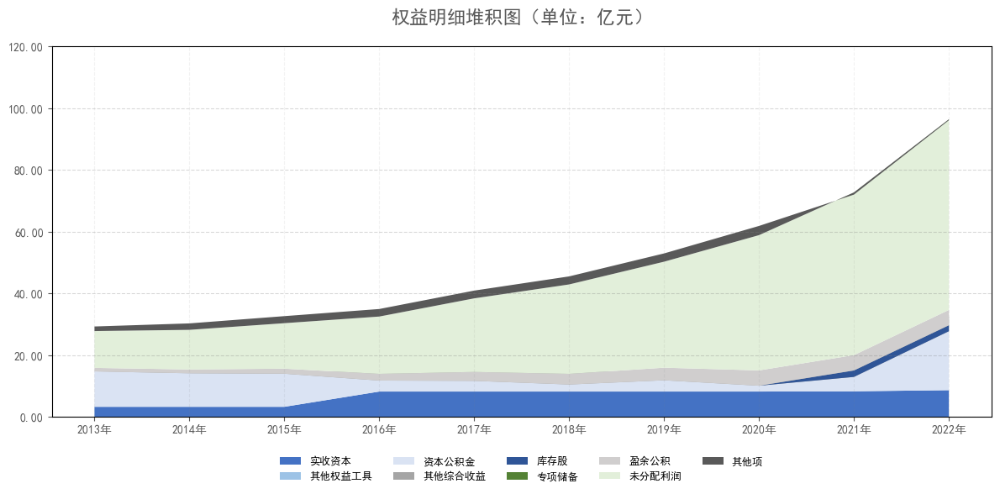
    


```python
import matplotlib.pyplot as plt
import pandas as pd
import matplotlib.ticker as ticker

# 1. Prepare the Data
# Transcribed from the provided source image (image_9b2d84.png)
data = {
    "年份": ["2013年", "2014年", "2015年", "2016年", "2017年", "2018年", "2019年", "2020年", "2021年", "2022年"],
    "ROE": [5.41, 5.30, 9.56, 17.01, 23.88, 21.06, 19.34, 25.12, 20.54, 16.40]
}

df = pd.DataFrame(data)

# 2. Plotting
plt.rcParams['font.sans-serif'] = ['SimHei']  # Use SimHei for Chinese characters
plt.rcParams['axes.unicode_minus'] = False 

fig, ax = plt.subplots(figsize=(10, 6))

# Plot the line
# Using a specific blue color to match the reference image
ax.plot(df["年份"], df["ROE"], color="#5B9BD5", linewidth=2) 

# 3. Add Data Labels (The numbers on the line)
for i, val in enumerate(df["ROE"]):
    # Use 'i' for the x-coordinate (index) and 'val' for y-coordinate
    # Offset the text slightly above the point (val + 0.5)
    ax.text(i, val + 0.8, f"{val:.2f}", 
            ha='center', va='bottom', fontsize=11, color='#404040')

# 4. Styling
ax.set_title("净资产收益率ROE (%)", fontsize=16, pad=20, color='#595959')

# Y-axis formatting
ax.set_ylim(0, 32) # Set slightly higher than max value to make room for labels
ax.yaxis.set_major_formatter(ticker.FormatStrFormatter('%.2f'))
ax.tick_params(axis='both', colors='#595959', labelsize=11)

# X-axis configuration
# Ensure all years are shown
ax.set_xticks(range(len(df["年份"])))
ax.set_xticklabels(df["年份"])

# Grid configuration
# The reference has a subtle grid background
ax.grid(True, linestyle='--', alpha=0.3, color='#C0C0C0')

# Adjust layout
plt.tight_layout()

plt.show()
```


    
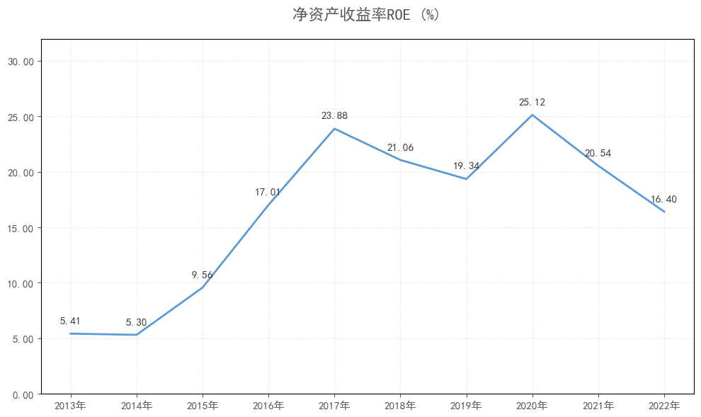
    


```python
import matplotlib.pyplot as plt
import pandas as pd
import matplotlib.ticker as ticker

# 1. Prepare the Data
# Transcribed from the provided source image (image_9b3143.png)
data = {
    "年份": ["2019年", "2020年", "2021年", "2022年"],
    "销售净利率": [12.28, 15.92, 12.38, 10.50]
}

df = pd.DataFrame(data)

# 2. Plotting
plt.rcParams['font.sans-serif'] = ['SimHei']  # Use SimHei for Chinese characters
plt.rcParams['axes.unicode_minus'] = False 

fig, ax = plt.subplots(figsize=(8, 5)) # Adjusted size to match the aspect ratio

# Plot the line
# Using the standard Excel/Office blue color
ax.plot(df["年份"], df["销售净利率"], color="#5B9BD5", linewidth=2) 

# 3. Add Data Labels
for i, val in enumerate(df["销售净利率"]):
    # Position the text slightly above the data point
    ax.text(i, val + 0.5, f"{val:.2f}", 
            ha='center', va='bottom', fontsize=11, color='#404040')

# 4. Styling
ax.set_title("销售净利率", fontsize=16, pad=20, color='#595959')

# Y-axis formatting
# Setting limit to 18 to match the visual reference
ax.set_ylim(0, 18) 
ax.yaxis.set_major_locator(ticker.MultipleLocator(2)) # Set ticks every 2 units
ax.yaxis.set_major_formatter(ticker.FormatStrFormatter('%.2f'))
ax.tick_params(axis='both', colors='#595959', labelsize=11)

# X-axis configuration
ax.set_xticks(range(len(df["年份"])))
ax.set_xticklabels(df["年份"])

# Grid configuration
ax.grid(True, linestyle='--', alpha=0.3, color='#C0C0C0')

# Adjust layout
plt.tight_layout()

plt.show()
```


    

    


```python
import matplotlib.pyplot as plt
import pandas as pd
import matplotlib.ticker as ticker

# 1. Prepare the Data
data = {
    "年份": ["2019年", "2020年", "2021年", "2022年"],
    "存货周转率": [2.58, 2.96, 3.66, 3.67],
    "应收账款周转率": [9.07, 11.08, 11.11, 9.49],
    "固定资产周转率": [1.53, 1.72, 1.97, 2.02],
    "总资产周转率": [0.81, 0.86, 0.88, 0.85]
}

df = pd.DataFrame(data)
df.set_index("年份", inplace=True)

# 2. Define Colors
colors = {
    "存货周转率": "#5B9BD5",       # Blue
    "应收账款周转率": "#ED7D31",   # Orange
    "固定资产周转率": "#A5A5A5",   # Grey
    "总资产周转率": "#FFC000"      # Yellow
}

# 3. Plotting
plt.rcParams['font.sans-serif'] = ['SimHei']  # Use SimHei for Chinese characters
plt.rcParams['axes.unicode_minus'] = False 

fig, ax = plt.subplots(figsize=(10, 6))

# Loop through columns to plot each line
for column in df.columns:
    # Plot the line
    ax.plot(df.index, df[column], color=colors[column], linewidth=2, label=column)
    
    # Add Data Labels using annotate (CORRECTED SECTION)
    for i, val in enumerate(df[column]):
        ax.annotate(f"{val:.2f}", 
                    xy=(i, val),                # The point (x, y) to annotate
                    xytext=(0, 5),              # Offset: 0 points horizontal, 5 points vertical
                    textcoords='offset points', # Interpret xytext as offset in points
                    ha='center', 
                    fontsize=10, 
                    color='#404040')

# 4. Styling
ax.set_title("主要资产周转率", fontsize=16, pad=20, color='#595959')

# Y-axis formatting
ax.set_ylim(0, 12.50)
ax.yaxis.set_major_locator(ticker.MultipleLocator(2.00)) 
ax.yaxis.set_major_formatter(ticker.FormatStrFormatter('%.2f'))
ax.tick_params(axis='both', colors='#595959', labelsize=11)

# Grid configuration
ax.grid(True, linestyle='--', alpha=0.3, color='#C0C0C0')

# Legend configuration
plt.legend(loc='upper center', bbox_to_anchor=(0.5, -0.08),
          fancybox=False, shadow=False, ncol=4, frameon=False, fontsize=10)

plt.tight_layout()
plt.show()
```


    
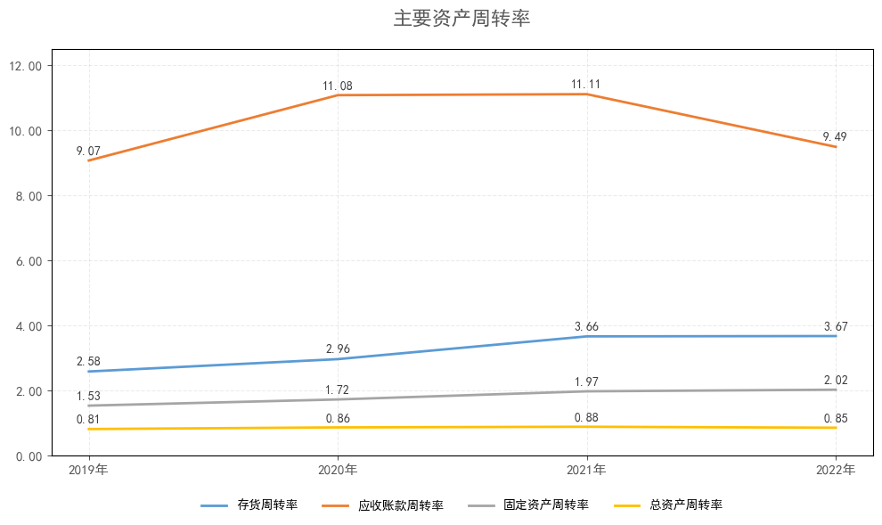
    


```python
import matplotlib.pyplot as plt
import pandas as pd
import matplotlib.ticker as ticker

# 1. Prepare the Data
data = {
    "年份": ["2019年", "2020年", "2021年", "2022年"],
    "权益乘数": [2.03, 1.90, 1.90, 1.89]
}

df = pd.DataFrame(data)

# 2. Plotting
plt.rcParams['font.sans-serif'] = ['SimHei']  # Use SimHei for Chinese characters
plt.rcParams['axes.unicode_minus'] = False 

fig, ax = plt.subplots(figsize=(8, 5)) 

# Plot the line
ax.plot(df["年份"], df["权益乘数"], color="#5B9BD5", linewidth=2) 

# 3. Add Data Labels (FIXED)
# Using ax.annotate() instead of ax.text() to support 'xytext' offset
for i, val in enumerate(df["权益乘数"]):
    ax.annotate(f"{val:.2f}", 
                xy=(i, val),                # The point to label (x, y)
                xytext=(5, 0),              # Offset: 5 points right, 0 points vertical
                textcoords='offset points', # Interpret xytext as relative offset
                ha='left', 
                va='bottom', 
                fontsize=11, 
                color='#404040')

# 4. Styling
ax.set_title("权益乘数", fontsize=16, pad=20, color='#595959')

# Y-axis formatting
ax.set_ylim(0, 2.50) 
ax.yaxis.set_major_locator(ticker.MultipleLocator(0.50)) 
ax.yaxis.set_major_formatter(ticker.FormatStrFormatter('%.2f'))
ax.tick_params(axis='both', colors='#595959', labelsize=11)

# X-axis configuration
ax.set_xticks(range(len(df["年份"])))
ax.set_xticklabels(df["年份"])

# Grid configuration
ax.grid(True, linestyle='--', alpha=0.3, color='#C0C0C0')

# Adjust layout
plt.tight_layout()

plt.show()
```


    
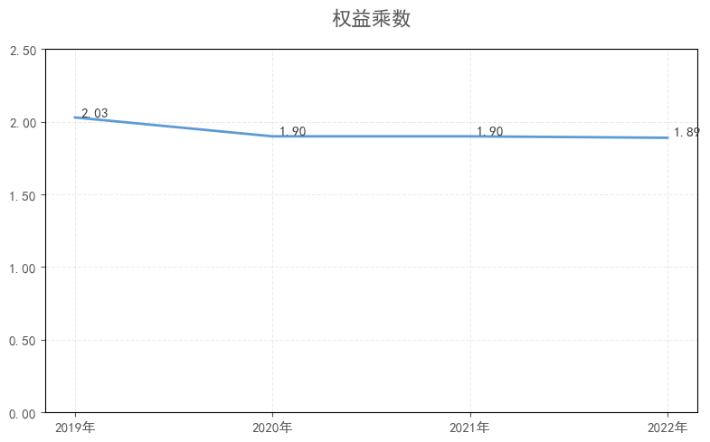
    


```python
import matplotlib.pyplot as plt
import pandas as pd
import matplotlib.ticker as ticker
import numpy as np

# 1. Prepare the Data
# Transcribed from the provided source image (image_9b4483.png)
# Values are in percent (without the % sign)
data = {
    "年份": ["2019年", "2020年", "2021年", "2022年"],
    "营业成本占收入比": [65.00, 66.00, 72.66, 75.20],
    "税金及附加占比": [0.90, 0.89, 0.82, 0.73],
    "销售费用占比": [11.57, 7.23, 6.26, 5.68],
    "管理费用占比": [3.34, 3.51, 3.37, 3.03],
    "研发费用占比": [4.36, 4.32, 4.45, 4.17],
    "主营业务利润占比": [14.84, 18.04, 12.45, 11.19]
}

df = pd.DataFrame(data)
df.set_index("年份", inplace=True)

# 2. Define Colors
# Matching the reference chart:
# Deep Red, Brown/Orange, Orange, Yellow, Pale Yellow, Blue
colors = [
    "#C00000", # 营业成本 (Deep Red)
    "#C65911", # 税金及附加 (Dark Orange/Brown)
    "#F4B084", # 销售费用 (Light Orange)
    "#FFC000", # 管理费用 (Yellow)
    "#FFF2CC", # 研发费用 (Pale Yellow)
    "#4472C4"  # 主营业务利润 (Blue)
]

# 3. Plotting
plt.rcParams['font.sans-serif'] = ['SimHei']  # Use SimHei for Chinese characters
plt.rcParams['axes.unicode_minus'] = False 

fig, ax = plt.subplots(figsize=(10, 6))

# Create the Stacked Bar Chart
# We use the previous columns as the "bottom" for the next segment
bottom = np.zeros(len(df))

for i, col in enumerate(df.columns):
    # Plot the bar segment
    bars = ax.bar(df.index, df[col], bottom=bottom, label=col, color=colors[i], width=0.4)
    
    # Add Data Labels inside the bars
    # Using ax.bar_label is the cleanest modern way, but manual loop offers more control over position/color
    for bar in bars:
        height = bar.get_height()
        # Only label if the segment is large enough to be readable (e.g. > 2%)
        if height > 0.0: 
            # Determine text color (White for dark bars, Black for light bars)
            text_color = 'white' if i == 0 or i == 5 else '#404040' 
            
            ax.annotate(f"{height:.2f}%",
                        xy=(bar.get_x() + bar.get_width() / 2, bar.get_y() + height / 2),
                        ha='center', va='center',
                        fontsize=10, color=text_color)

    # Update the bottom tracker
    bottom += df[col]

# 4. Styling
ax.set_title("收入成本费用构成图", fontsize=16, pad=20, color='#595959')

# Y-axis formatting
# Set range 0-100%
ax.set_ylim(0, 100)
ax.yaxis.set_major_formatter(ticker.PercentFormatter()) # Adds % sign to axis
ax.tick_params(axis='both', colors='#595959', labelsize=11)

# Grid configuration
ax.grid(axis='y', linestyle='--', alpha=0.3, color='gray')
ax.grid(axis='x', linestyle='--', alpha=0.1, color='gray') # Faint x-grid

# Legend configuration
# Placed at the bottom, 3 columns to fit neatly
plt.legend(loc='upper center', bbox_to_anchor=(0.5, -0.08),
          fancybox=False, shadow=False, ncol=3, frameon=False, fontsize=10)

plt.tight_layout()
plt.show()
```


    
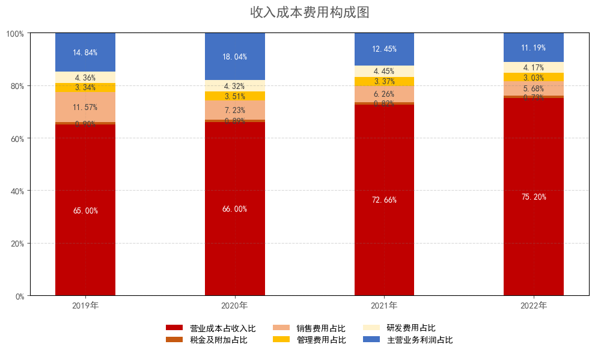
    


```python
import matplotlib.pyplot as plt
import pandas as pd
import matplotlib.ticker as ticker

# 1. Prepare the Data
# Transcribed from the provided source image (image_9b4842.png)
data = {
    "年份": ["2019年", "2020年", "2021年", "2022年"],
    "毛利率": [35.00, 34.00, 27.34, 24.80]
}

df = pd.DataFrame(data)

# 2. Plotting
plt.rcParams['font.sans-serif'] = ['SimHei']  # Use SimHei for Chinese characters
plt.rcParams['axes.unicode_minus'] = False 

fig, ax = plt.subplots(figsize=(8, 5)) 

# Plot the line
# Using the standard blue color matching the reference
ax.plot(df["年份"], df["毛利率"], color="#5B9BD5", linewidth=2) 

# 3. Add Data Labels
for i, val in enumerate(df["毛利率"]):
    # Use annotate to place the text precisely
    ax.annotate(f"{val:.2f}%", 
                xy=(i, val),                
                xytext=(0, 5),              # Offset slightly upwards
                textcoords='offset points', 
                ha='center', va='bottom', 
                fontsize=11, 
                color='#404040')

# 4. Styling
ax.set_title("毛利率", fontsize=16, pad=20, color='#595959')

# Y-axis formatting
# Setting limit from 0% to 40% to match the reference image
ax.set_ylim(0, 40) 
ax.yaxis.set_major_locator(ticker.MultipleLocator(5)) # Set ticks every 5 units
ax.yaxis.set_major_formatter(ticker.PercentFormatter(decimals=2)) # Format as percentage
ax.tick_params(axis='both', colors='#595959', labelsize=11)

# X-axis configuration
ax.set_xticks(range(len(df["年份"])))
ax.set_xticklabels(df["年份"])

# Grid configuration
ax.grid(True, linestyle='--', alpha=0.3, color='#C0C0C0')

# Adjust layout
plt.tight_layout()

plt.show()
```


    
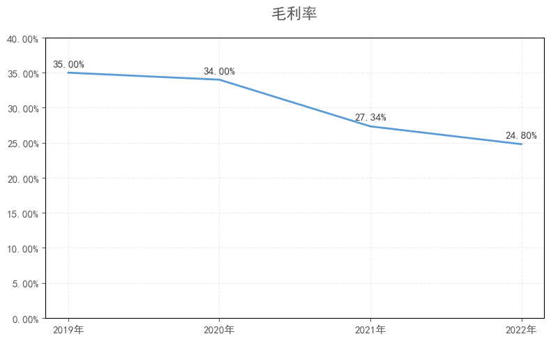
    


```python
import matplotlib.pyplot as plt
import pandas as pd
import matplotlib.ticker as ticker

# 1. Prepare the Data
# Transcribed from the provided source image (image_9c1a59.png)
data = {
    "年份": ["2019年", "2020年", "2021年", "2022年"],
    "销售费用率": [11.57, 7.23, 6.26, 5.68]
}

df = pd.DataFrame(data)

# 2. Plotting
plt.rcParams['font.sans-serif'] = ['SimHei']  # Use SimHei for Chinese characters
plt.rcParams['axes.unicode_minus'] = False 

fig, ax = plt.subplots(figsize=(8, 5))

# Plot Bar Chart
# Using the standard Excel blue color
bars = ax.bar(df["年份"], df["销售费用率"], color="#5B9BD5", width=0.4)

# 3. Add Data Labels
for bar in bars:
    height = bar.get_height()
    ax.annotate(f"{height:.2f}%",
                xy=(bar.get_x() + bar.get_width() / 2, height),
                xytext=(0, 3), # Offset 3 points vertically
                textcoords="offset points",
                ha='center', va='bottom', fontsize=11, color='#404040')

# 4. Styling
ax.set_title("销售费用率", fontsize=16, pad=20, color='#595959')

# Y-axis formatting
# Range 0% to 12% to match reference
ax.set_ylim(0, 13) 
ax.yaxis.set_major_locator(ticker.MultipleLocator(2)) # Ticks every 2 units
ax.yaxis.set_major_formatter(ticker.PercentFormatter(decimals=2)) # Format as percentage
ax.tick_params(axis='both', colors='#595959', labelsize=11)

# Grid configuration
ax.grid(True, axis='y', linestyle='--', alpha=0.3, color='#C0C0C0')

# Adjust layout
plt.tight_layout()

plt.show()
```


    
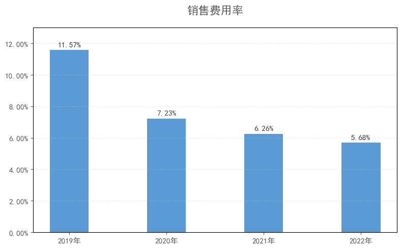
    


```python
import matplotlib.pyplot as plt
import pandas as pd
import matplotlib.ticker as ticker

# 1. Prepare the Data
# Transcribed from the provided source image (image_9c2ca8.png)
data = {
    "年份": ["2019年", "2020年", "2021年", "2022年"],
    "管理费用率": [3.34, 3.51, 3.37, 3.03]
}

df = pd.DataFrame(data)

# 2. Plotting
plt.rcParams['font.sans-serif'] = ['SimHei']  # Use SimHei for Chinese characters
plt.rcParams['axes.unicode_minus'] = False 

fig, ax = plt.subplots(figsize=(8, 5))

# Plot Bar Chart
# Using the standard Excel blue color
bars = ax.bar(df["年份"], df["管理费用率"], color="#5B9BD5", width=0.4)

# 3. Add Data Labels
for bar in bars:
    height = bar.get_height()
    ax.annotate(f"{height:.2f}%",
                xy=(bar.get_x() + bar.get_width() / 2, height),
                xytext=(0, 3), # Offset 3 points vertically
                textcoords="offset points",
                ha='center', va='bottom', fontsize=11, color='#404040')

# 4. Styling
ax.set_title("管理费用率", fontsize=16, pad=20, color='#595959')

# Y-axis formatting
# Range 0% to 4% to match reference
ax.set_ylim(0, 4.2) 
ax.yaxis.set_major_locator(ticker.MultipleLocator(0.5)) # Ticks every 0.5 units
ax.yaxis.set_major_formatter(ticker.PercentFormatter(decimals=2)) # Format as percentage
ax.tick_params(axis='both', colors='#595959', labelsize=11)

# Grid configuration
ax.grid(True, axis='y', linestyle='--', alpha=0.3, color='#C0C0C0')

# Adjust layout
plt.tight_layout()

plt.show()
```


    
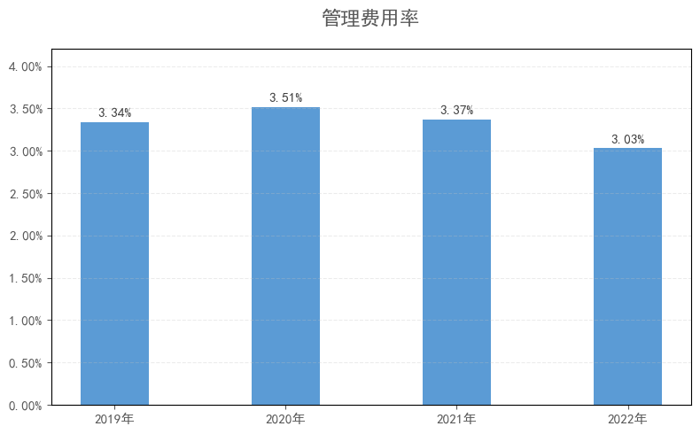
    


```python
import matplotlib.pyplot as plt
import pandas as pd
import matplotlib.ticker as ticker

# 1. Prepare the Data
# Transcribed from the provided source image (image_9c2d80.png)
data = {
    "年份": ["2019年", "2020年", "2021年", "2022年"],
    "研发费用率": [4.36, 4.32, 4.45, 4.17]
}

df = pd.DataFrame(data)

# 2. Plotting
plt.rcParams['font.sans-serif'] = ['SimHei']  # Use SimHei for Chinese characters
plt.rcParams['axes.unicode_minus'] = False 

fig, ax = plt.subplots(figsize=(8, 5))

# Plot Bar Chart
# Using the standard Excel blue color
bars = ax.bar(df["年份"], df["研发费用率"], color="#5B9BD5", width=0.4)

# 3. Add Data Labels
for bar in bars:
    height = bar.get_height()
    ax.annotate(f"{height:.2f}%",
                xy=(bar.get_x() + bar.get_width() / 2, height),
                xytext=(0, 3), # Offset 3 points vertically
                textcoords="offset points",
                ha='center', va='bottom', fontsize=11, color='#404040')

# 4. Styling
ax.set_title("研发费用率", fontsize=16, pad=20, color='#595959')

# Y-axis formatting
# IMPORTANT: The reference chart starts the Y-axis at 4.00%, not 0.00%
# This creates a "zoomed in" effect to highlight small differences.
ax.set_ylim(4.00, 4.55) 
ax.yaxis.set_major_locator(ticker.MultipleLocator(0.05)) # Ticks every 0.05 units
ax.yaxis.set_major_formatter(ticker.FormatStrFormatter('%.2f%%')) # Add % sign manually
ax.tick_params(axis='both', colors='#595959', labelsize=11)

# Grid configuration
ax.grid(True, axis='y', linestyle='--', alpha=0.3, color='#C0C0C0')

# Adjust layout
plt.tight_layout()

plt.show()
```


    
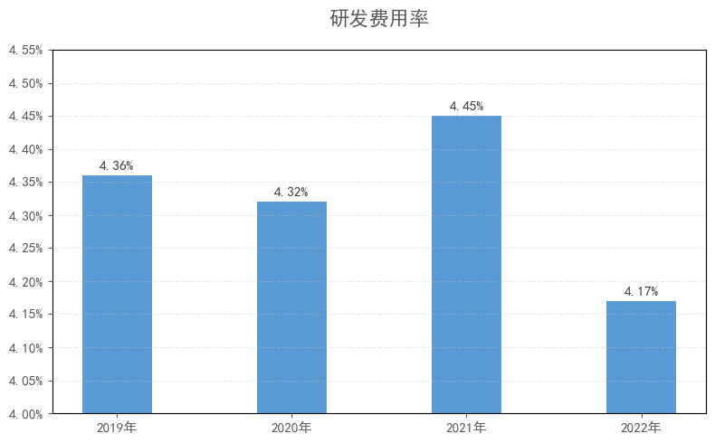
    


```python
import matplotlib.pyplot as plt
import pandas as pd
import matplotlib.ticker as ticker
import numpy as np

# 1. Prepare the Data
# Transcribed from the provided source image (image_9b4b83.png)
data = {
    "年份": ["2019年", "2020年", "2021年", "2022年"],
    "主营业务利润": [11.35, 16.12, 13.29, 14.37],
    "财务费用": [-0.78, -1.04, -0.79, -0.06],
    "减值损失": [-0.16, -0.42, -0.38, -0.91],
    "公允价值变动收益": [0.00, 0.00, 0.00, 0.00],  # All "-" in source
    "投资收益": [-0.07, -0.03, 0.08, 0.06],
    "资产处置收益": [0.00, 0.00, 0.01, 0.01],
    "其他收益": [0.65, 1.63, 2.79, 2.34],
    "营业外收入": [0.14, 0.14, 0.26, 0.18],
    "营业外支出": [-0.04, -0.12, -0.09, -0.04]
}

df = pd.DataFrame(data)
df.set_index("年份", inplace=True)

# 2. Define Colors
# Matching the reference chart:
# Blue, Orange, Yellow, Green, Light Blue, Light Grey, Dark Orange, Dark Grey, Grey
colors = {
    "主营业务利润": "#4472C4",       # Blue
    "财务费用": "#ED7D31",           # Orange
    "减值损失": "#FFC000",           # Yellow
    "公允价值变动收益": "#70AD47",   # Green
    "投资收益": "#9DC3E6",           # Light Blue
    "资产处置收益": "#D9D9D9",       # Light Grey
    "其他收益": "#C65911",           # Dark Orange/Brown
    "营业外收入": "#595959",         # Dark Grey
    "营业外支出": "#A5A5A5"          # Medium Grey
}

# 3. Plotting
plt.rcParams['font.sans-serif'] = ['SimHei']  # Use SimHei for Chinese characters
plt.rcParams['axes.unicode_minus'] = False 

fig, ax = plt.subplots(figsize=(12, 6))

# Parameters for grouped bar chart
x = np.arange(len(df.index))
width = 0.8 / len(df.columns)  # Calculate bar width to fit all groups
multiplier = 0

# Plot bars for each category
for attribute, measurement in df.items():
    offset = width * multiplier
    rects = ax.bar(x + offset, measurement, width, label=attribute, color=colors[attribute])
    
    # Add Data Labels
    # We only label significant bars to avoid clutter, similar to the image
    # The image labels: Main Profit, Other Income, and some negative values.
    # Logic: Label if abs(value) > 0.5 or it's the "Main Business Profit"
    for rect in rects:
        height = rect.get_height()
        if abs(height) > 0.05: # Threshold to label distinct bars
            # Adjust label position: Above for positive, Below for negative
            xy_pos = (rect.get_x() + rect.get_width() / 2, height)
            xy_text = (0, 3) if height >= 0 else (0, -10)
            
            ax.annotate(f"{height:.2f}",
                        xy=xy_pos,
                        xytext=xy_text,
                        textcoords="offset points",
                        ha='center', va='bottom',
                        fontsize=9, color='#404040')
            
    multiplier += 1

# 4. Styling
ax.set_title("历年利润主要来源（单位：亿元）", fontsize=16, pad=20, color='#595959')

# X-axis configuration
# Center ticks in the middle of the group
ax.set_xticks(x + width * (len(df.columns) - 1) / 2)
ax.set_xticklabels(df.index)

# Y-axis formatting
# Range -2 to 18
ax.set_ylim(-2.00, 18.00)
ax.yaxis.set_major_locator(ticker.MultipleLocator(2.00)) 
ax.yaxis.set_major_formatter(ticker.FormatStrFormatter('%.2f'))
ax.tick_params(axis='both', colors='#595959', labelsize=11)

# Grid configuration
ax.grid(axis='y', linestyle='--', alpha=0.3, color='gray')
ax.grid(axis='x', linestyle='--', alpha=0.1, color='gray')

# Legend configuration
# Placed at the bottom, 3 columns to fit neatly
plt.legend(loc='upper center', bbox_to_anchor=(0.5, -0.08),
          fancybox=False, shadow=False, ncol=3, frameon=False, fontsize=10)

plt.tight_layout()
plt.show()

#主营业务利润 = 营业收入 - 营业成本 - 营业税金及附加 - 销售费用 - 管理费用 - 研发费用
```


    
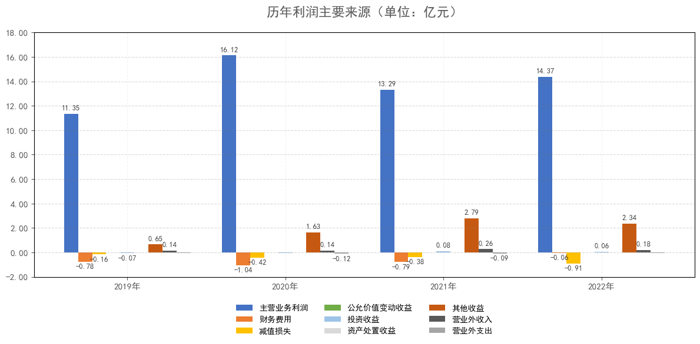
    


```python
import matplotlib.pyplot as plt
import pandas as pd
import matplotlib.ticker as ticker
import numpy as np

# 1. Prepare the Data
# Transcribed from the provided source image (image_9ba25d.png)
data = {
    "年份": ["2017年", "2018年", "2019年", "2020年", "2021年", "2022年"],
    "经营活动现金流量净额": [11.22, 11.44, 12.96, 18.69, 13.19, 10.69],
    "筹资活动现金流量净额": [-1.01, -1.37, -4.27, -4.67, 8.40, 14.11],
    "投资活动现金流量净额": [-9.07, -10.12, -8.15, -7.77, -19.51, -25.14]
}

df = pd.DataFrame(data)
df.set_index("年份", inplace=True)

# 2. Define Colors
colors = {
    "经营活动现金流量净额": "#C00000",  # Deep Red
    "筹资活动现金流量净额": "#4472C4",  # Blue
    "投资活动现金流量净额": "#ED7D31"   # Orange
}

# 3. Plotting
plt.rcParams['font.sans-serif'] = ['SimHei']  # Use SimHei for Chinese characters
plt.rcParams['axes.unicode_minus'] = False 

fig, ax = plt.subplots(figsize=(10, 6))

# Initialize "bottoms" for positive and negative stacks
# This ensures positive bars grow up from 0, and negative bars grow down from 0
pos_bottom = np.zeros(len(df))
neg_bottom = np.zeros(len(df))

for col in df.columns:
    values = df[col].values
    
    # Split data into positive and negative components for correct stacking
    pos_values = np.where(values > 0, values, 0)
    neg_values = np.where(values < 0, values, 0)
    
    # Plot Positive Bars
    bars_pos = ax.bar(df.index, pos_values, width=0.5, bottom=pos_bottom, 
                      color=colors[col], label=col if col not in ax.get_legend_handles_labels()[1] else "")
    
    # Plot Negative Bars
    bars_neg = ax.bar(df.index, neg_values, width=0.5, bottom=neg_bottom, 
                      color=colors[col]) # No label here to avoid duplicate legend entries
    
    # Update bottoms
    pos_bottom += pos_values
    neg_bottom += neg_values
    
    # --- Add Data Labels ---
    # We combine bars_pos and bars_neg to label all visible segments
    for bars in [bars_pos, bars_neg]:
        for bar in bars:
            height = bar.get_height()
            # Only label if the bar has a non-zero height
            if abs(height) > 0.01:
                # Calculate Y position: middle of the bar
                # bar.get_y() is the bottom edge, so we add half height
                y_pos = bar.get_y() + height / 2
                
                ax.annotate(f"{height:.2f}",
                            xy=(bar.get_x() + bar.get_width() / 2, y_pos),
                            ha='center', va='center',
                            fontsize=10, color='white') # White text stands out on dark bars

# 4. Styling
ax.set_title("三类现金流量净额（单位：亿元）", fontsize=16, pad=20, color='#595959')

# Y-axis formatting
ax.set_ylim(-30, 30)
ax.yaxis.set_major_formatter(ticker.FormatStrFormatter('%.2f'))
ax.tick_params(axis='both', colors='#595959', labelsize=11)

# Grid configuration
ax.grid(axis='y', linestyle='--', alpha=0.3, color='gray')
ax.grid(axis='x', linestyle='--', alpha=0.1, color='gray')

# Legend configuration
# Filter unique handles/labels to avoid duplicates from the split plotting
handles, labels = plt.gca().get_legend_handles_labels()
by_label = dict(zip(labels, handles))
plt.legend(by_label.values(), by_label.keys(), 
           loc='upper center', bbox_to_anchor=(0.5, -0.08),
           fancybox=False, shadow=False, ncol=3, frameon=False, fontsize=10)

plt.tight_layout()
plt.show()
```


    
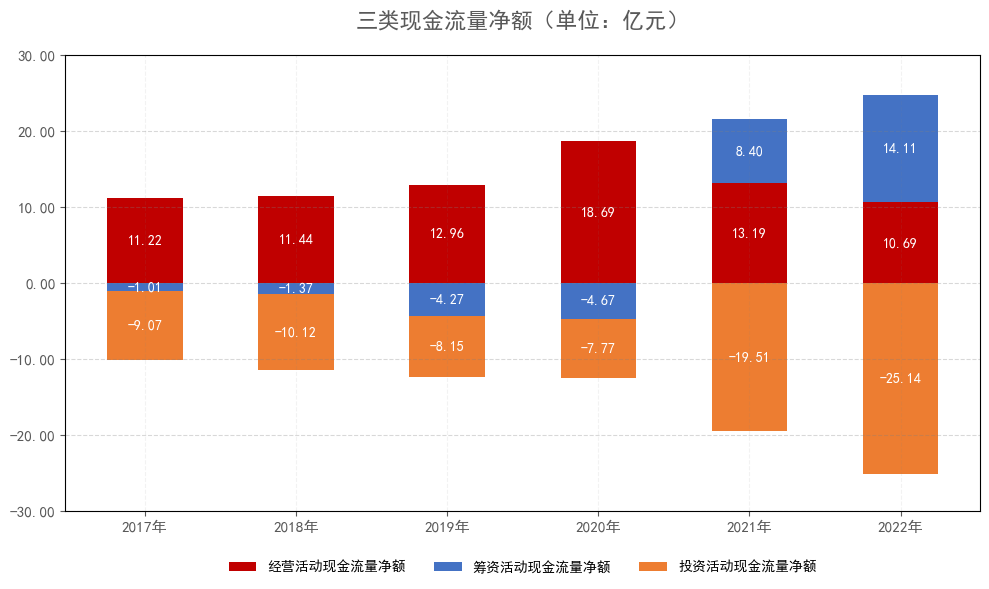
    


```python
import matplotlib.pyplot as plt
import pandas as pd
import matplotlib.ticker as ticker
import numpy as np

# 1. Prepare the Data
# Transcribed from the provided source image (image_9baa17.png)
# Positive values are Inflows, Negative values are Outflows (Expenditures)
data = {
    "年份": ["2017年", "2018年", "2019年", "2020年", "2021年", "2022年"],
    # Inflows (Positive)
    "收回投资净流入": [0.00, 0.00, 0.00, 0.00, 0.27, 0.00],
    "投资收益收到的现金": [0.05, 0.00, 0.00, 0.00, 0.00, 0.00],
    "处置长期资产现金": [0.01, 0.01, 0.12, 0.06, 0.11, 0.24],
    "处置公司现金": [0.00, 0.00, 0.00, 0.00, 0.00, 0.23],
    "收到其他投资净流入": [0.15, 0.00, 0.00, 0.00, 0.00, 0.00],
    # Outflows (Negative) - Note: Input as negative numbers for the chart
    "购建长期资产支出": [-9.27, -10.12, -8.27, -7.83, -19.89, -25.36],
    "其他项": [0.00, 0.00, 0.00, 0.00, 0.00, -0.25] # Represents '取得子公司...' outflow in 2022
}

df = pd.DataFrame(data)
df.set_index("年份", inplace=True)

# 2. Define Colors
# Matching the reference chart 'image_9ba659.png'
colors = {
    "收回投资净流入": "#5B9BD5",      # Light Blue
    "投资收益收到的现金": "#ED7D31",  # Orange
    "处置长期资产现金": "#A5A5A5",    # Grey
    "处置公司现金": "#FFC000",        # Yellow
    "收到其他投资净流入": "#4472C4",  # Dark Blue
    "购建长期资产支出": "#70AD47",    # Green
    "其他项": "#255E91"               # Darker Blue
}

# 3. Plotting
plt.rcParams['font.sans-serif'] = ['SimHei']  # Use SimHei for Chinese characters
plt.rcParams['axes.unicode_minus'] = False 

fig, ax = plt.subplots(figsize=(10, 6))

# Initialize "bottoms" for positive and negative stacks
pos_bottom = np.zeros(len(df))
neg_bottom = np.zeros(len(df))

# Loop through columns to plot stacked bars
for col in df.columns:
    values = df[col].values
    
    # Check if the series is predominantly positive or negative to decide stack direction
    if (values >= 0).all():
        # Plot Positive Bar
        bars = ax.bar(df.index, values, width=0.4, bottom=pos_bottom, 
                      color=colors[col], label=col)
        pos_bottom += values
        
        # Label positive bars if significant
        for bar in bars:
            height = bar.get_height()
            if height > 0.1: # Only label visible segments
                ax.annotate(f"{height:.2f}",
                            xy=(bar.get_x() + bar.get_width() / 2, bar.get_y() + height / 2),
                            ha='center', va='center', fontsize=9, color='white')
                
    else:
        # Plot Negative Bar
        bars = ax.bar(df.index, values, width=0.4, bottom=neg_bottom, 
                      color=colors[col], label=col)
        neg_bottom += values
        
        # Label negative bars
        for bar in bars:
            height = bar.get_height()
            if abs(height) > 1.0: # Only label significant bars (like the green ones)
                # Place label inside the bar
                ax.annotate(f"{height:.2f}",
                            xy=(bar.get_x() + bar.get_width() / 2, bar.get_y() + height / 2),
                            ha='center', va='center', fontsize=10, color='white')

# 4. Styling
ax.set_title("投资活动现金流明细（单位：亿元）", fontsize=16, pad=20, color='#595959')

# Y-axis formatting
# Range -30 to 5
ax.set_ylim(-30, 5)
ax.yaxis.set_major_locator(ticker.MultipleLocator(5)) 
ax.yaxis.set_major_formatter(ticker.FormatStrFormatter('%.2f'))
ax.tick_params(axis='both', colors='#595959', labelsize=11)

# Grid configuration
ax.grid(axis='y', linestyle='--', alpha=0.3, color='gray')
ax.grid(axis='x', linestyle='--', alpha=0.1, color='gray')

# Legend configuration
# 3 Rows (ncol=3) to fit all items
plt.legend(loc='upper center', bbox_to_anchor=(0.5, -0.08),
          fancybox=False, shadow=False, ncol=3, frameon=False, fontsize=10)

plt.tight_layout()
plt.show()
```


    
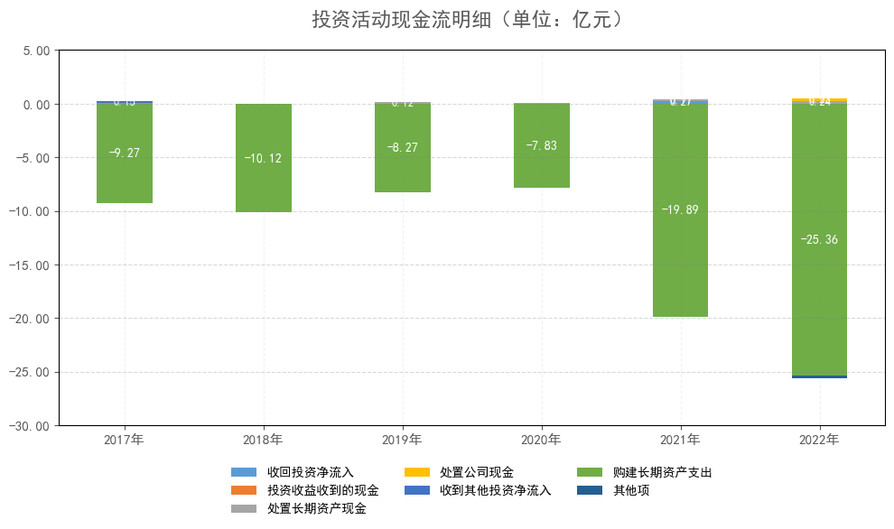
    


```python
import matplotlib.pyplot as plt
import pandas as pd
import matplotlib.ticker as ticker
import numpy as np

# 1. Prepare the Data
# Transcribed from the provided source image (image_9bb101.png)
data = {
    "年份": ["2017年", "2018年", "2019年", "2020年", "2021年", "2022年"],
    "吸收投资收到现金": [0.00, 0.00, 0.00, 0.03, 2.68, 14.08],
    "取得债务净流入": [2.51, 2.77, 0.02, -2.66, 11.19, 6.17],
    "收到其他投资净流入": [0.00, -0.00, -0.29, 2.12, -0.28, -0.44],
    "利润分配及付利息": [-3.51, -4.14, -4.00, -4.16, -5.19, -5.70],
    "购买子公司少数股权": [0.00, 0.00, 0.00, 0.00, 0.00, 0.00],
    "其他项": [0.00, 0.00, -0.00, 0.00, 0.00, -0.00]
}

df = pd.DataFrame(data)
df.set_index("年份", inplace=True)

# 2. Define Colors
# Matching the reference chart 'image_9bb0e5.png'
colors = {
    "吸收投资收到现金": "#5B9BD5",      # Light Blue
    "取得债务净流入": "#ED7D31",        # Orange
    "收到其他投资净流入": "#A5A5A5",    # Grey
    "利润分配及付利息": "#FFC000",      # Yellow
    "购买子公司少数股权": "#4472C4",    # Dark Blue
    "其他项": "#70AD47"                 # Green
}

# 3. Plotting
plt.rcParams['font.sans-serif'] = ['SimHei']  # Use SimHei for Chinese characters
plt.rcParams['axes.unicode_minus'] = False 

fig, ax = plt.subplots(figsize=(10, 6))

# Initialize "bottoms" for positive and negative stacks
pos_bottom = np.zeros(len(df))
neg_bottom = np.zeros(len(df))

for col in df.columns:
    values = df[col].values
    
    # Split into positive and negative components for correct stacking
    # This is important because '取得债务净流入' flips between positive and negative
    pos_values = np.where(values > 0, values, 0)
    neg_values = np.where(values < 0, values, 0)
    
    # Plot Positive Component
    bars_pos = ax.bar(df.index, pos_values, width=0.4, bottom=pos_bottom, 
                      color=colors[col], label=col)
    
    # Plot Negative Component
    bars_neg = ax.bar(df.index, neg_values, width=0.4, bottom=neg_bottom, 
                      color=colors[col]) # No label to avoid legend duplicates
    
    # Update bottoms
    pos_bottom += pos_values
    neg_bottom += neg_values
    
    # Labeling Logic
    # Combine bars to check both positive and negative segments
    for bars in [bars_pos, bars_neg]:
        for bar in bars:
            height = bar.get_height()
            # Only label significant bars to avoid clutter
            if abs(height) > 0.1:
                # Calculate center position
                y_pos = bar.get_y() + height / 2
                
                # Determine text color (Dark Grey for lighter bars like Yellow, White for others)
                text_color = '#404040' if col == "利润分配及付利息" else 'white'
                
                ax.annotate(f"{height:.2f}",
                            xy=(bar.get_x() + bar.get_width() / 2, y_pos),
                            ha='center', va='center',
                            fontsize=10, color=text_color)

# 4. Styling
ax.set_title("筹资活动现金流明细（单位：亿元）", fontsize=16, pad=20, color='#595959')

# Y-axis formatting
# Range -10 to 25 to match reference
ax.set_ylim(-10, 25)
ax.yaxis.set_major_locator(ticker.MultipleLocator(5)) 
ax.yaxis.set_major_formatter(ticker.FormatStrFormatter('%.2f'))
ax.tick_params(axis='both', colors='#595959', labelsize=11)

# Grid configuration
ax.grid(axis='y', linestyle='--', alpha=0.3, color='gray')
ax.grid(axis='x', linestyle='--', alpha=0.1, color='gray')

# Legend configuration
# 3 Rows (ncol=3) to fit all items neatly
# We only want one legend entry per color, so we filter handles
handles, labels = plt.gca().get_legend_handles_labels()
by_label = dict(zip(labels, handles))
plt.legend(by_label.values(), by_label.keys(), 
           loc='upper center', bbox_to_anchor=(0.5, -0.08),
           fancybox=False, shadow=False, ncol=3, frameon=False, fontsize=10)

plt.tight_layout()
plt.show()
```


    
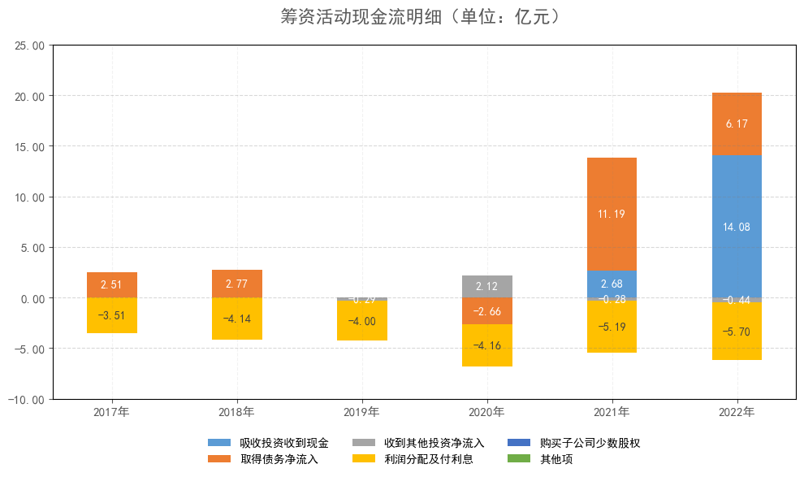
    


```python
import matplotlib.pyplot as plt
import pandas as pd
import matplotlib.ticker as ticker
import numpy as np

# 1. Prepare the Data
# Transcribed from the provided source image (image_9bb4fc.png)
data = {
    "年份": ["2013年", "2014年", "2015年", "2016年", "2017年", "2018年", "2019年", "2020年", "2021年", "2022年"],
    "经营活动现金流量净额": [4.88, 6.99, 5.71, 7.80, 11.22, 11.44, 12.96, 18.69, 13.19, 10.69],
    "购建长期资产支出": [-6.94, -4.15, -2.76, -7.97, -9.27, -10.12, -8.27, -7.83, -19.89, -25.36]
}

df = pd.DataFrame(data)
df.set_index("年份", inplace=True)

# 2. Define Colors
# Matching the reference chart: Deep Red (Operating Cash Flow) and Orange (CapEx)
colors = {
    "经营活动现金流量净额": "#C00000",
    "购建长期资产支出": "#ED7D31"
}

# 3. Plotting
plt.rcParams['font.sans-serif'] = ['SimHei']  # Use SimHei for Chinese characters
plt.rcParams['axes.unicode_minus'] = False 

fig, ax = plt.subplots(figsize=(10, 6))

# Plot Operating Cash Flow (Positive Bars)
bars1 = ax.bar(df.index, df["经营活动现金流量净额"], width=0.5, 
               color=colors["经营活动现金流量净额"], label="经营活动现金流量净额")

# Plot Capital Expenditure (Negative Bars)
bars2 = ax.bar(df.index, df["购建长期资产支出"], width=0.5, 
               color=colors["购建长期资产支出"], label="购建长期资产支出")

# 4. Add Data Labels
# Iterate through both sets of bars to add white labels in the center
for bars in [bars1, bars2]:
    for bar in bars:
        height = bar.get_height()
        # Calculate center position
        # For negative bars, height is negative, so y + height/2 works correctly
        y_pos = bar.get_y() + height / 2
        
        ax.annotate(f"{height:.2f}",
                    xy=(bar.get_x() + bar.get_width() / 2, y_pos),
                    ha='center', va='center',
                    fontsize=10, color='white')

# 5. Styling
ax.set_title("经营活动现金流量净额和购建长期资产支出（单位：亿元）", fontsize=16, pad=20, color='#595959')

# Y-axis formatting
# Range -30 to 25 to match reference
ax.set_ylim(-30, 25)
ax.yaxis.set_major_locator(ticker.MultipleLocator(5)) 
ax.yaxis.set_major_formatter(ticker.FormatStrFormatter('%.2f'))
ax.tick_params(axis='both', colors='#595959', labelsize=11)

# Grid configuration
ax.grid(axis='y', linestyle='--', alpha=0.3, color='gray')
ax.grid(axis='x', linestyle='--', alpha=0.1, color='gray')

# Legend configuration
plt.legend(loc='upper center', bbox_to_anchor=(0.5, -0.08),
          fancybox=False, shadow=False, ncol=2, frameon=False, fontsize=10)

plt.tight_layout()
plt.show()
```


    
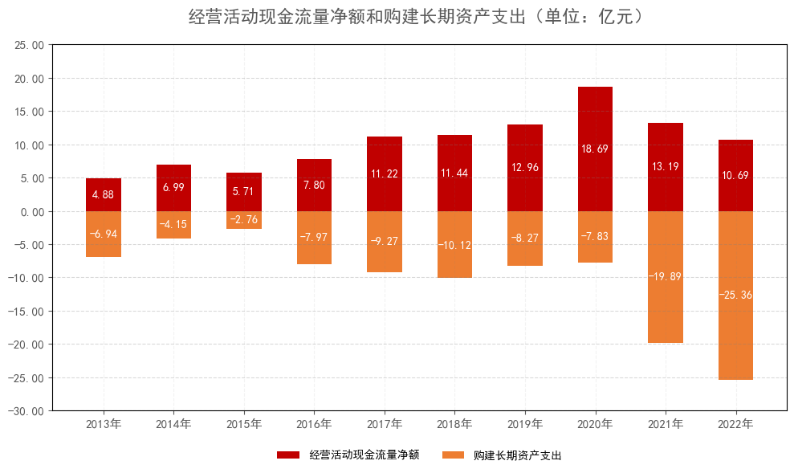
    


```python
import matplotlib.pyplot as plt
import pandas as pd
import matplotlib.ticker as ticker

# 1. Prepare the Data
# Transcribed from the provided source image (image_9bb888.png)
data = {
    "年份": ["2013年", "2014年", "2015年", "2016年", "2017年", "2018年", "2019年", "2020年", "2021年", "2022年"],
    "营业收入": [31.19, 36.54, 42.13, 48.61, 57.76, 66.86, 76.53, 89.33, 106.75, 128.43],
    "销售收到现金": [35.32, 42.05, 43.23, 52.98, 65.22, 78.11, 88.13, 102.98, 117.72, 144.33]
}

df = pd.DataFrame(data)
df.set_index("年份", inplace=True)

# 2. Define Colors
# Matching the reference: Blue for Revenue, Red for Cash
colors = {
    "营业收入": "#4472C4",      # Blue
    "销售收到现金": "#C00000"   # Deep Red
}

# 3. Plotting
plt.rcParams['font.sans-serif'] = ['SimHei']  # Use SimHei for Chinese characters
plt.rcParams['axes.unicode_minus'] = False 

fig, ax = plt.subplots(figsize=(10, 6))

# Plot Lines
# We iterate to handle specific styling for each line
for col in df.columns:
    ax.plot(df.index, df[col], color=colors[col], linewidth=2, label=col)
    
    # Add Data Labels
    # Logic based on visual reference:
    # Red line (Cash) labels are generally ABOVE the line.
    # Blue line (Revenue) labels are generally BELOW the line.
    offset_y = 8 if col == "销售收到现金" else -12
    va_align = 'bottom' if col == "销售收到现金" else 'top'
    
    for i, val in enumerate(df[col]):
        ax.annotate(f"{val:.2f}",
                    xy=(i, val),
                    xytext=(0, offset_y),       # Offset up for Red, down for Blue
                    textcoords='offset points',
                    ha='center', va=va_align,
                    fontsize=10, color='#404040')

# 4. Styling
ax.set_title("营业收入和销售收到现金（单位：亿元）", fontsize=16, pad=20, color='#595959')

# Y-axis formatting
# Range 0 to 160
ax.set_ylim(0, 160)
ax.yaxis.set_major_locator(ticker.MultipleLocator(20)) # Ticks every 20 units
ax.yaxis.set_major_formatter(ticker.FormatStrFormatter('%.2f'))
ax.tick_params(axis='both', colors='#595959', labelsize=11)

# Grid configuration
ax.grid(True, linestyle='--', alpha=0.3, color='#C0C0C0')

# Legend configuration
plt.legend(loc='upper center', bbox_to_anchor=(0.5, -0.08),
          fancybox=False, shadow=False, ncol=2, frameon=False, fontsize=10)

plt.tight_layout()
plt.show()
```


    
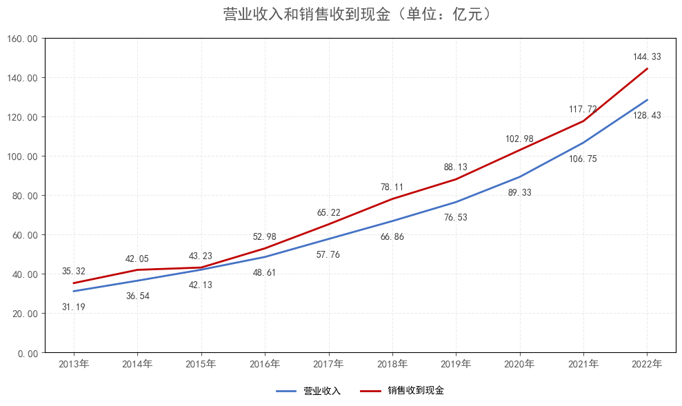
    


```python
import matplotlib.pyplot as plt
import pandas as pd
import matplotlib.ticker as ticker

# 1. Prepare the Data
# Transcribed from the provided source image (image_9bb8c6.png)
data = {
    "年份": ["2013年", "2014年", "2015年", "2016年", "2017年", "2018年", "2019年", "2020年", "2021年", "2022年"],
    "净利润": [1.82, 1.77, 3.19, 5.78, 8.93, 9.00, 9.40, 14.22, 13.21, 13.49],
    "经营净额": [4.88, 6.99, 5.71, 7.80, 11.22, 11.44, 12.96, 18.69, 13.19, 10.69]
}

df = pd.DataFrame(data)
df.set_index("年份", inplace=True)

# 2. Define Colors
# Matching the reference: Blue for Net Profit, Red for Operating Cash Flow
colors = {
    "净利润": "#4472C4",      # Blue
    "经营净额": "#C00000"     # Deep Red
}

# 3. Plotting
plt.rcParams['font.sans-serif'] = ['SimHei']  # Use SimHei for Chinese characters
plt.rcParams['axes.unicode_minus'] = False 

fig, ax = plt.subplots(figsize=(10, 6))

# Plot Lines
for col in df.columns:
    ax.plot(df.index, df[col], color=colors[col], linewidth=2, label=col)
    
    # Add Data Labels
    # Logic based on visual reference:
    # Red line (Operating Cash) is generally higher, so labels go ABOVE
    # Blue line (Net Profit) is generally lower, so labels go BELOW
    # Note: In 2021 they are very close (13.21 vs 13.19), so careful offsetting helps
    
    offset_y = 8 if col == "经营净额" else -12
    va_align = 'bottom' if col == "经营净额" else 'top'
    
    for i, val in enumerate(df[col]):
        ax.annotate(f"{val:.2f}",
                    xy=(i, val),
                    xytext=(0, offset_y),       
                    textcoords='offset points',
                    ha='center', va=va_align,
                    fontsize=10, color='#404040')

# 4. Styling
ax.set_title("净利润和经营净额（单位：亿元）", fontsize=16, pad=20, color='#595959')

# Y-axis formatting
# Range 0 to 20
ax.set_ylim(0, 20)
ax.yaxis.set_major_locator(ticker.MultipleLocator(2)) # Ticks every 2 units
ax.yaxis.set_major_formatter(ticker.FormatStrFormatter('%.2f'))
ax.tick_params(axis='both', colors='#595959', labelsize=11)

# Grid configuration
ax.grid(True, linestyle='--', alpha=0.3, color='#C0C0C0')

# Legend configuration
plt.legend(loc='upper center', bbox_to_anchor=(0.5, -0.08),
          fancybox=False, shadow=False, ncol=2, frameon=False, fontsize=10)

plt.tight_layout()
plt.show()
```


    
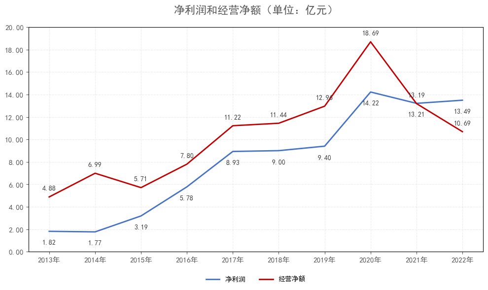
    


```python
import matplotlib.pyplot as plt
import pandas as pd
import matplotlib.ticker as ticker
import numpy as np

# 1. Prepare the Data
# Transcribed from the provided source image (image_9bbfcc.png)
data = {
    "年份": ["2013年", "2014年", "2015年", "2016年", "2017年", "2018年", "2019年", "2020年", "2021年", "2022年"],
    "营业收入": [31.19, 36.54, 42.13, 48.61, 57.76, 66.86, 76.53, 89.33, 106.75, 128.43],
    "营收增速": [None, 17.14, 15.30, 15.36, 18.83, 15.75, 14.47, 16.73, 19.50, 20.31] # 2013 is blank in source
}

df = pd.DataFrame(data)

# 2. Plotting
plt.rcParams['font.sans-serif'] = ['SimHei']  # Use SimHei for Chinese characters
plt.rcParams['axes.unicode_minus'] = False 

fig, ax1 = plt.subplots(figsize=(10, 6))

# --- Primary Axis (Left) - Bar Chart for Revenue ---
# Using standard blue color
bars = ax1.bar(df["年份"], df["营业收入"], color="#5B9BD5", width=0.4, label="营业收入")

# Add Data Labels for Bars
for bar in bars:
    height = bar.get_height()
    ax1.annotate(f"{height:.2f}",
                 xy=(bar.get_x() + bar.get_width() / 2, height),
                 xytext=(0, 3), # 3 points vertical offset
                 textcoords="offset points",
                 ha='center', va='bottom', fontsize=10, color='#404040')

# --- Secondary Axis (Right) - Line Chart for Growth ---
ax2 = ax1.twinx()
# Using standard orange color
# We drop the first NaN value for plotting to avoid warnings, though matplotlib handles NaNs gracefully
ax2.plot(df["年份"], df["营收增速"], color="#ED7D31", linewidth=2, marker='.', markersize=0, label="营收增速(%)")

# Add Data Labels for Line
# Skip index 0 because 2013 has no growth data
for i, val in enumerate(df["营收增速"]):
    if pd.notna(val): # Check if value exists
        ax2.annotate(f"{val:.2f}",
                     xy=(i, val),
                     xytext=(0, 5), # Place label slightly above the point
                     textcoords="offset points",
                     ha='center', va='bottom', fontsize=10, color='#404040')

# 3. Styling
ax1.set_title("营业收入和增速 (%)", fontsize=16, pad=20, color='#595959')

# Primary Y-Axis (Revenue) Configuration
ax1.set_ylim(0, 140)
ax1.yaxis.set_major_locator(ticker.MultipleLocator(20))
ax1.tick_params(axis='y', colors='#595959', labelsize=10)
ax1.tick_params(axis='x', colors='#595959', labelsize=10)

# Secondary Y-Axis (Growth) Configuration
ax2.set_ylim(0, 25)
ax2.yaxis.set_major_locator(ticker.MultipleLocator(5))
ax2.tick_params(axis='y', colors='#595959', labelsize=10)
# Hide the secondary grid to prevent clutter (only show primary grid)
ax2.grid(False)

# Grid configuration (Primary Axis)
ax1.grid(True, axis='y', linestyle='--', alpha=0.3, color='#C0C0C0')

# Legend configuration
# Combine handles from both axes
lines_1, labels_1 = ax1.get_legend_handles_labels()
lines_2, labels_2 = ax2.get_legend_handles_labels()

plt.legend(lines_1 + lines_2, labels_1 + labels_2, 
           loc='upper center', bbox_to_anchor=(0.5, -0.08),
           fancybox=False, shadow=False, ncol=2, frameon=False, fontsize=10)

plt.tight_layout()
plt.show()
```


    
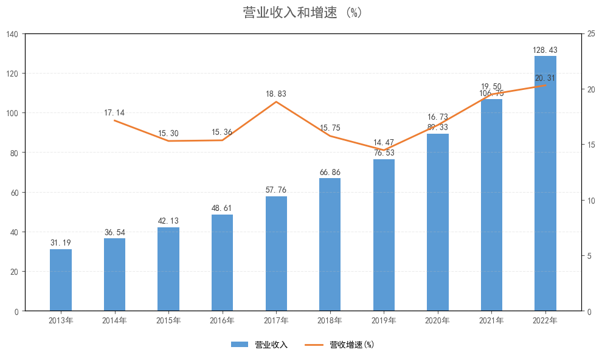
    


```python
import matplotlib.pyplot as plt
import pandas as pd
import matplotlib.ticker as ticker
import numpy as np

# 1. Prepare the Data
# Transcribed from the provided source image (image_9c125b.png)
data = {
    "年份": ["2013年", "2014年", "2015年", "2016年", "2017年", "2018年", "2019年", "2020年", "2021年", "2022年"],
    "净利润": [1.82, 1.77, 3.19, 5.78, 8.93, 9.00, 9.40, 14.22, 13.21, 13.49],
    "净利润增速": [None, -2.86, 80.24, 81.22, 54.55, 0.79, 4.47, 51.31, -7.08, 2.07] # 2013 is blank
}

df = pd.DataFrame(data)

# 2. Plotting
plt.rcParams['font.sans-serif'] = ['SimHei']  # Use SimHei for Chinese characters
plt.rcParams['axes.unicode_minus'] = False 

fig, ax1 = plt.subplots(figsize=(10, 6))

# --- Primary Axis (Left) - Bar Chart for Net Profit ---
# Using standard blue color
bars = ax1.bar(df["年份"], df["净利润"], color="#5B9BD5", width=0.4, label="净利润")

# Add Data Labels for Bars
for bar in bars:
    height = bar.get_height()
    ax1.annotate(f"{height:.2f}",
                 xy=(bar.get_x() + bar.get_width() / 2, height),
                 xytext=(0, 3), # 3 points vertical offset
                 textcoords="offset points",
                 ha='center', va='bottom', fontsize=10, color='#404040')

# --- Secondary Axis (Right) - Line Chart for Growth ---
ax2 = ax1.twinx()
# Using standard orange color
ax2.plot(df["年份"], df["净利润增速"], color="#ED7D31", linewidth=2, marker='.', markersize=0, label="净利润增速(%)")

# Add Data Labels for Line
for i, val in enumerate(df["净利润增速"]):
    if pd.notna(val): # Check if value exists (skip 2013)
        # Smart positioning: move label below point if it's a "peak" or high value to avoid clipping top
        # For this specific chart, most labels are above, but let's stick to standard offset
        xy_text = (0, 5) 
        va_align = 'bottom'
        
        # Specific visual adjustment for 2021 (negative value) to ensure it doesn't overlap bar
        if val < 0:
            xy_text = (0, -12)
            va_align = 'top'

        ax2.annotate(f"{val:.2f}",
                     xy=(i, val),
                     xytext=xy_text,
                     textcoords="offset points",
                     ha='center', va=va_align, fontsize=10, color='#404040')

# 3. Styling
ax1.set_title("净利润和增速 (%)", fontsize=16, pad=20, color='#595959')

# Primary Y-Axis (Net Profit) Configuration
# Range 0 to 16
ax1.set_ylim(0, 16)
ax1.yaxis.set_major_locator(ticker.MultipleLocator(2))
ax1.tick_params(axis='y', colors='#595959', labelsize=10)
ax1.tick_params(axis='x', colors='#595959', labelsize=10)

# Secondary Y-Axis (Growth) Configuration
# Range -20 to 90 to match visual reference
ax2.set_ylim(-20, 90)
ax2.yaxis.set_major_locator(ticker.MultipleLocator(10))
ax2.tick_params(axis='y', colors='#595959', labelsize=10)
# Hide secondary grid
ax2.grid(False)

# Grid configuration (Primary Axis)
ax1.grid(True, axis='y', linestyle='--', alpha=0.3, color='#C0C0C0')

# Legend configuration
lines_1, labels_1 = ax1.get_legend_handles_labels()
lines_2, labels_2 = ax2.get_legend_handles_labels()

plt.legend(lines_1 + lines_2, labels_1 + labels_2, 
           loc='upper center', bbox_to_anchor=(0.5, -0.08),
           fancybox=False, shadow=False, ncol=2, frameon=False, fontsize=10)

plt.tight_layout()
plt.show()
```


    
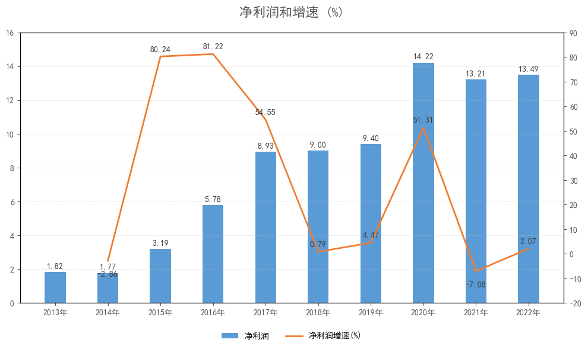
    


```python

```
